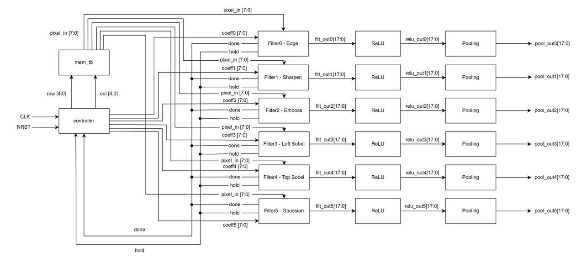
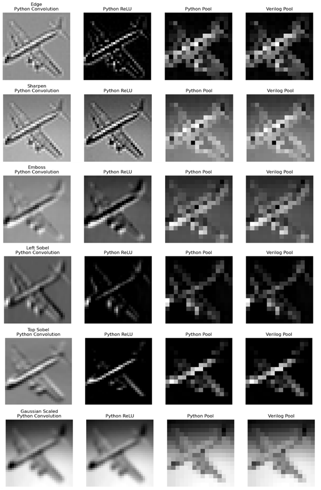

# CNN Node Module on FPGA (Phase 3)

> FPGA implementation of a CNN Node Module featuring parallel convolution, ReLU activation, and 2×2 max pooling using Verilog and the Arty A7-35 FPGA.

---

## Overview

This project implements the Convolutional Neural Network (CNN) image classification system on FPGA. The design extends the previous convolution module by integrating:

- ReLU activation
- 2×2 Max Pooling
- Six parallel convolution channels

The system processes a **32×32 grayscale image** and performs:

1. Convolution
2. Activation
3. Pooling

to generate pooled feature maps for subsequent CNN stages.

---

## CNN Processing Pipeline

## Features

- Six parallel convolution kernels
- ReLU activation function
- 2×2 max pooling
- Hardware-based CNN feature extraction
- Low FPGA resource utilization
- Python verification model
- Behavioral and post-synthesis verification

---

## Implemented Filters

| Filter | Purpose |
|-------|----------|
| Edge Detection | Detect image edges |
| Sharpen | Enhance details |
| Emboss | Produce embossed features |
| Left Sobel | Vertical edge detection |
| Top Sobel | Horizontal edge detection |
| Gaussian Blur | Image smoothing |

---

## Architecture

The NODE module consists of:

- Controller
- Image memory interface
- Six MAC convolution filters
- Six ReLU activation blocks
- Six Max Pooling blocks

All six channels operate simultaneously, allowing multiple feature maps to be generated in parallel.

---

## Input Specifications

| Parameter | Value |
|----------|--------|
| Image Size | 32 × 32 |
| Pixel Width | 8-bit unsigned |
| Kernel Size | 3 × 3 |
| Number of Filters | 6 |
| Convolution Output | 18-bit signed |
| ReLU Output | 18-bit unsigned |
| Pooling Window | 2 × 2 |
| Output Size | 16 × 16 |

---

## Performance

| Parameter | Value |
|----------|--------|
| Clock Frequency | 2.77 MHz |
| Clock Period | 361.7 ns |
| Processing Cycles | 9216 |
| Processing Time | 3.33 ms |
| Throughput | 300 FPS |
| Power Consumption | 0.06 W |

---

## FPGA Resource Utilization

| Resource | Used |
|---------|------:|
| LUTs | 166 |
| Flip-Flops | 184 |
| I/O Pins | 5 |
| BUFG | 1 |

The design occupies only a small percentage of the available resources on the Arty A7-35 FPGA.

---

## Verification

### Behavioral Simulation

- Convolution outputs verified
- ReLU activation verified
- Max pooling validated
- Parallel channel operation confirmed
- `done` and `pool_valid` signals verified

### Post-Synthesis Simulation

- Timing constraints satisfied
- No failing endpoints
- Positive setup and hold slack

### Python Verification

A Python reference model was developed to:

- Perform convolution
- Apply ReLU activation
- Perform max pooling
- Compare outputs against Verilog results

Result:

---

## Important Signals

| Signal | Description |
|-------|-------------|
| `row`, `col` | Memory addresses |
| `pixel_in` | Input pixel |
| `filt_out0-5` | Convolution outputs |
| `relu_out0-5` | ReLU outputs |
| `pool_out0-5` | Pooled outputs |
| `pool_valid` | Valid pooled output |
| `done` | Processing complete |
| `req` | Memory request complete |

---

## Future Improvements

- Fully connected layer implementation
- Output feature map memory
- BRAM storage
- External image input support
- Multi-layer CNN implementation
- Higher operating frequencies
- Larger image resolutions

---

## Tools Used

- Xilinx Vivado [Arty A7-35 FPGA board]
- Python via Jupyter Notebook

---

## Author & Citation

**Yi Man Eillen E. Chan**  
For my EE 227 – CNN Image Classification Project

If you use this project in academic work, please cite the accompanying Phase 3 report.

---

## License

This project is intended for educational and academic purposes.
